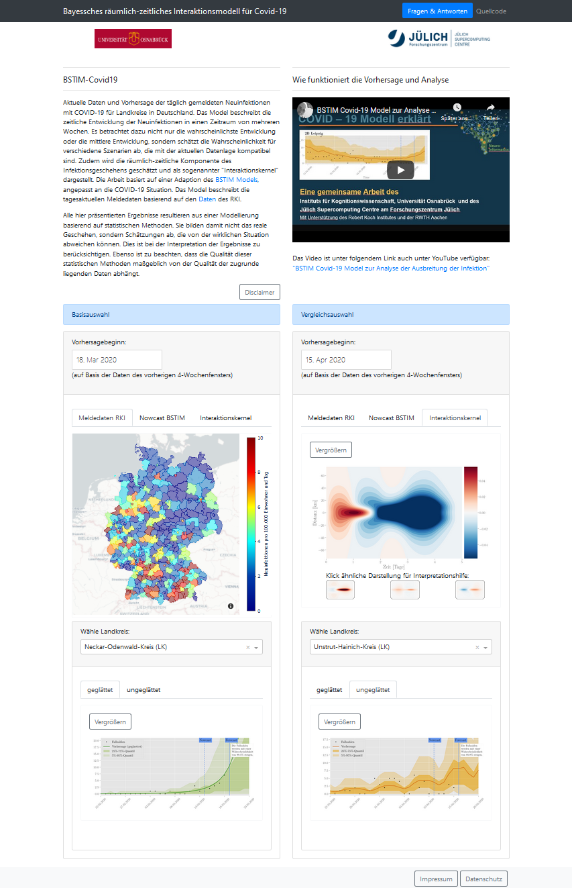

## Dashboard for Bayesian Spatio-Temporal Interaction Model (BSTIM)

See the dashboard in action at [Juelich Supercomputing Centre](https://covid19-bayesian.fz-juelich.de).  
For modeling details and simulation codes please check the [GitHub Repo](https://github.com/neuroinfo-os/BSTIM-Covid19)
of the [Neuroinformatics group at the University of Osnabrück](https://www.ikw.uni-osnabrueck.de/en/research_groups/neuroinformatics).




### Introduction to the Dashboard

Current data and forecast of the daily reported new infections with COVID-19 for districts in Germany. The model describes the temporal development of new infections over a period of several weeks. It not only considers the most probable development or the average development, but also estimates the probability for different scenarios that are compatible with the current data situation. In addition, the spatio-temporal component of the infection event is estimated and presented as a so-called "interaction kernel". The work is based on an adaptation of the BSTIM model, adapted to the COVID-19 situation. The model describes the daily updated reporting data based on the data of the RKI.

All results presented here result from a modeling based on statistical methods. Thus, they do not represent real events, but estimates that may differ from the actual situation. This has to be considered when interpreting the results. It should also be noted that the quality of these statistical methods depends largely on the quality of the underlying data.

### How does the prediction and analysis work?

Introductionary video to the modeling techniques (in german):
[BSTIM Covid-19 Model zur Analyse der Ausbreitung der Infektion](https://youtu.be/0jvH3nkjR9I)

### Running the web app locally

The easiest way is to clone this repository, create a virtual environment and install the required packages:

```
virtualenv -p python3 venv
source venv/bin/activate
pip install -r requirements.txt
```

To run the actual web app:

```
python app.py
```

The dashboard can then be used in a browser pointing to link http://127.0.0.1:8050/ .
Example data of Berlin on the 26th March 2020 is part of this repository.
